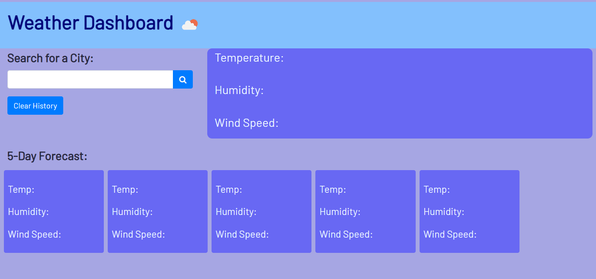
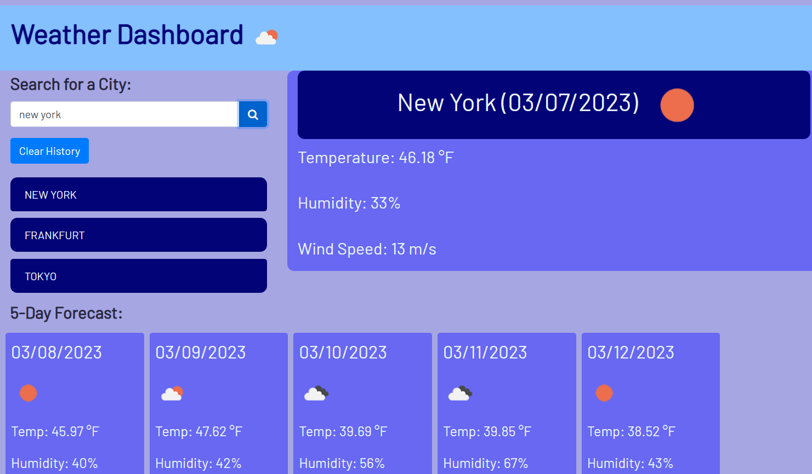

# Weather-Dashboard
### Description
Weather-Dashboard is an application used to find the weather condition of a given city for both the current day alongside the forecast for the next 5 days.
My motivation for working on this project is to learn how to use server-side APIs (The OpenWeatherMap API in this case), make requests to them, and use the data objects received in response.
The current weather section is including the following weather characters and date.

- City, Date, Icon-image
- Temperature
- Humidity
- Wind Speed

The 5-days weather forecast also displays below the current weather conditions section and it includes the following information for each day:

- Date
- Temperature
- Humidity
- Wind Speed

Local storage is used here to store the previous search city and display them to you in the left side of the page under the list group. The user can also clear the search history by clicking the clear history button.
If you would like to see the past search city weather condition again, just click the list group item cities under the clear history button.

## Check the live site [here](https://thossain30.github.io/WeatherDashboard/)

### Screenshots:

